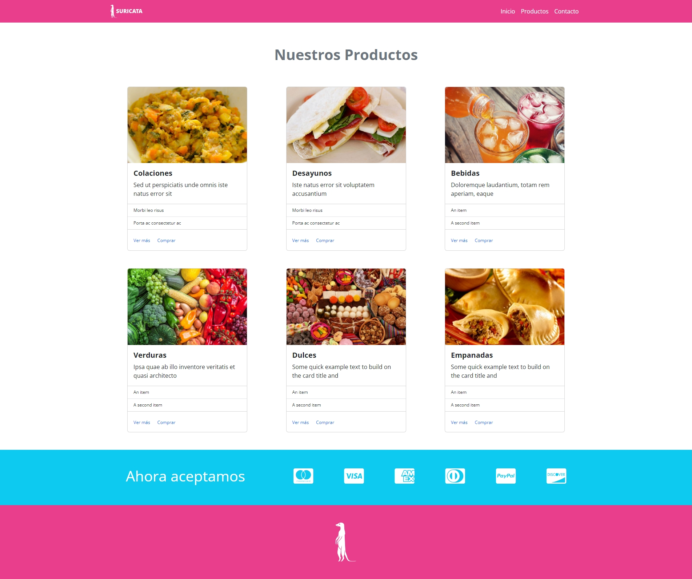
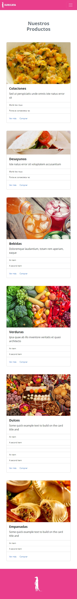

# Desafío Guiado - Suricata

Este es un proyecto web para una tienda en línea llamada Suricata, que ofrece una variedad de productos como colaciones, desayunos, bebidas, verduras, dulces y empanadas.

## Descripción

Suricata es una tienda en línea que ofrece una amplia gama de productos alimenticios. El sitio web está diseñado para proporcionar una experiencia de usuario agradable y fácil de usar, permitiendo a los clientes navegar por los productos y realizar compras de manera sencilla.

## Vista Codificada

A continuación, se muestra la imagen del resultado codificado:

Diseño Responsivo

## Estructura del Proyecto

El proyecto se compone de las siguientes secciones:

## Secciones del Sitio Web

- **Menú de Navegación (`<nav>`)**: Contiene enlaces a las diferentes secciones de la página, incluyendo Inicio, Productos y Contacto.
- **Encabezado (`<header>`)**: Presenta el título principal de la página destacando los productos ofrecidos.
- **Sección de Productos (`<header>`)**: Muestra una galería de productos con imágenes y descripciones.
- **Sección de Medios de Pago (`<section class="bg-info text-white p-5 d-none d-sm-none d-md-none d-lg-block">`)**: Proporciona información sobre los medios de pago aceptados.
- **Pie de Página (`<footer>`)**: Contiene el logo y el mensaje de derechos reservados.

## Tecnologías Utilizadas

- HTML5
- CSS3
- Bootstrap 5.3.2
- JavaScript (jQuery)
- Google Fonts (Open Sans)
- Font Awesome

## Autor

Este proyecto fue desarrollado por **Valeria Torrealba**.